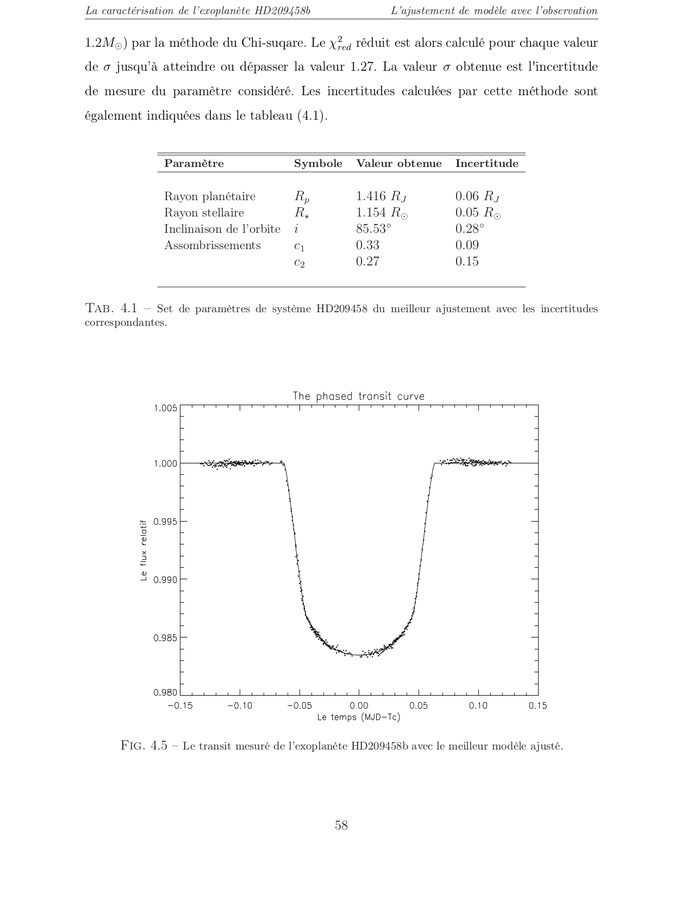
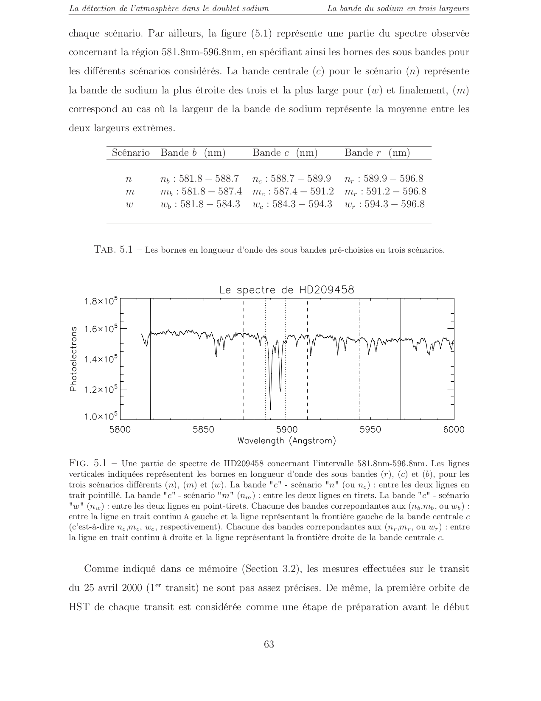

# Projet : Détection d'Exoplanètes et Caractérisation Atmosphérique (Master 2 Astrophysique)

## Contexte Scientifique & Reconversion Data Analyst

Ce projet représente mon travail de recherche de fin d'études de Master 2 en Astrophysique, axé sur la **détection et la caractérisation d'exoplanètes** par la méthode de la photométrie des transits, incluant l'étude de leur **atmosphère**. Il met en lumière ma capacité à manipuler et analyser des **données scientifiques complexes**, une compétence directement transférable et fondamentale dans mon parcours de reconversion vers le métier de Data Analyst.

L'astrophysique, et en particulier l'étude des exoplanètes, est un domaine riche en défis liés au traitement de données massives et bruitées. Les méthodologies développées ici (traitement de signaux, réduction de bruit, modélisation statistique) sont au cœur des pratiques du Data Analyst.

## Mission & Approche Data Science

L'objectif principal était de détecter et de caractériser des exoplanètes en analysant les variations de luminosité d'étoiles lointaines, ainsi que d'étudier la composition de leur atmosphère. Cela implique :

- **Acquisition et Nettoyage de Données Photométriques** : Traitement de séries temporelles de flux lumineux, identification et suppression des artefacts et du bruit instrumental.
- **Détection de Signaux Faibles** : Application d'algorithmes de recherche de transits planétaires (chutes périodiques de luminosité).
- **Modélisation et Caractérisation** : Utilisation de modèles physiques et statistiques pour ajuster les courbes de lumière et déduire les paramètres de l'exoplanète (rayon, période orbitale, inclinaison).
- **Analyse Spectroscopique de l'Atmosphère** : Détection de la présence de certains éléments (comme le sodium) dans l'atmosphère de l'exoplanète via l'analyse des spectres de transmission.
- **Analyse Statistique des Incertitudes** : Quantification des erreurs sur les paramètres dérivés, essentielle pour la robustesse des conclusions.

## Technologies & Compétences (Transfert vers la Data Science)

- ****IDL (Interactive Data Language)** pour l'Analyse Scientifique** : Manipulation de données (traitement de signaux, statistiques).
- **Traitement de Séries Temporelles** : Analyse de motifs périodiques et détection d'anomalies.
- **Modélisation Statistique** : Ajustement de modèles non linéaires, estimation de paramètres, quantification d'incertitudes.
- **Visualisation de Données** : Représentation de courbes de lumière, de résidus et de distributions de paramètres.
- **Rigueur Analytique & Résolution de Problèmes** : Capacité à aborder des problèmes complexes avec une approche structurée et basée sur les données.

## Livrables

- `Memoire_Magister_Detection_Exoplanete_Hamza_Yousfi.pdf` : Le mémoire complet de Master 2.
- `best_fit.png` : La courbe de lumière observée confrontée au meilleur ajustement (best fit).
- `sodium_histogram.png` : Un histogramme illustrant les résultats de la détection du sodium.

## Aperçu des Résultats

### Courbe de Lumière et Meilleur Ajustement (Best Fit)

### Détection du Sodium dans l'Atmosphère

---
*Par Hamza Yousfi, Data Analyst (2026)*
